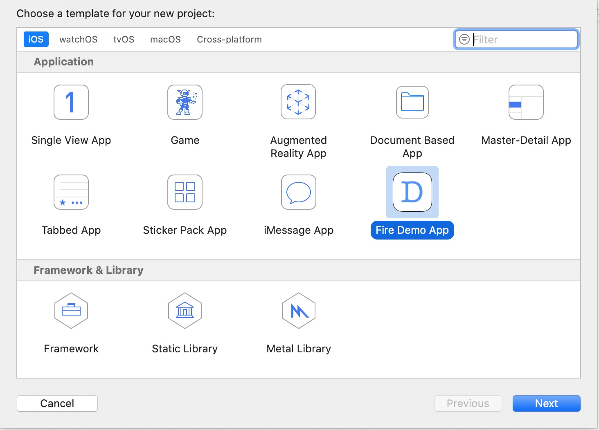
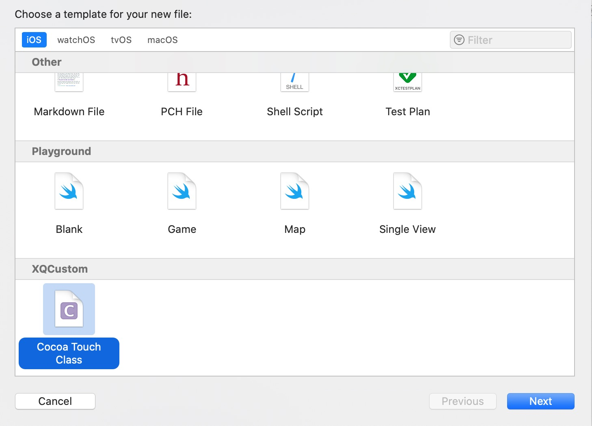
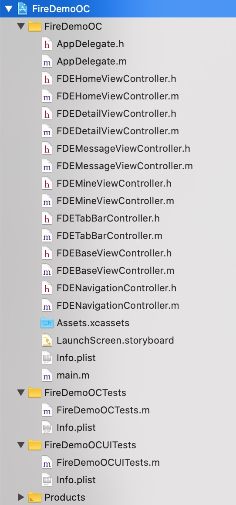
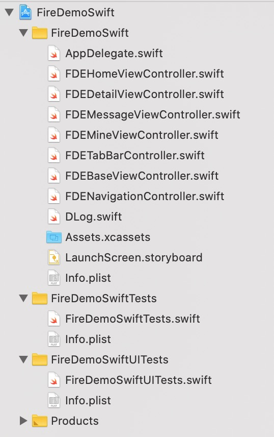

# FireDemoAppTemplate
自定义Xcode工程模板,使用该模板可以快速创建一个带tabBar+navigation 的Demo工程.

### 背景
很多时候我们需要一个较复杂场景的Demo工程来验证点东西,或者研究某个技术,直接在公司项目工程中实验,运行又太慢,并且还可能受到其他代码的影响,而Xcode自身提供的工程模板又太过简单,导致每次都要浪费很多时间编写重复的代码来搭建环境.为了提高效率,所以制作了该模板.

### 模板功能
1. 使用该模板创建的Demo工程包含一个tabBar控制器,及三个子navigation控制器.其中的FDEHomeViewController上添加了一个tableView,FDEMessageViewController上添加了一个按钮,这些都不需要你编写一行代码.  

2. 支持OC和Swift.  

注意:使用该模板创建的Demo工程为纯代码工程,不会创建Main.storyboard.

### 安装
方式一:  
在终端执行:
`curl https://raw.githubusercontent.com/xq-120/FireDemoAppTemplate/master/install.sh -s | sh`
如果没反应可能需要给终端开启代理.这个应该都懂得.

方式二:  
将`Fire Demo App.xctemplate`文件夹拷贝到`~/Library/Developer/Xcode/Templates/Project Templates/Application`目录下.  
将`XQCustom`文件夹拷贝到`~/Library/Developer/Xcode/Templates/File Templates`目录下.

最后重启Xcode.

### 效果
工程模板效果:

文件模板效果:

创建的Demo目录如下:

